#### AbstractMethodError
***

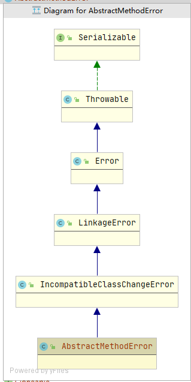

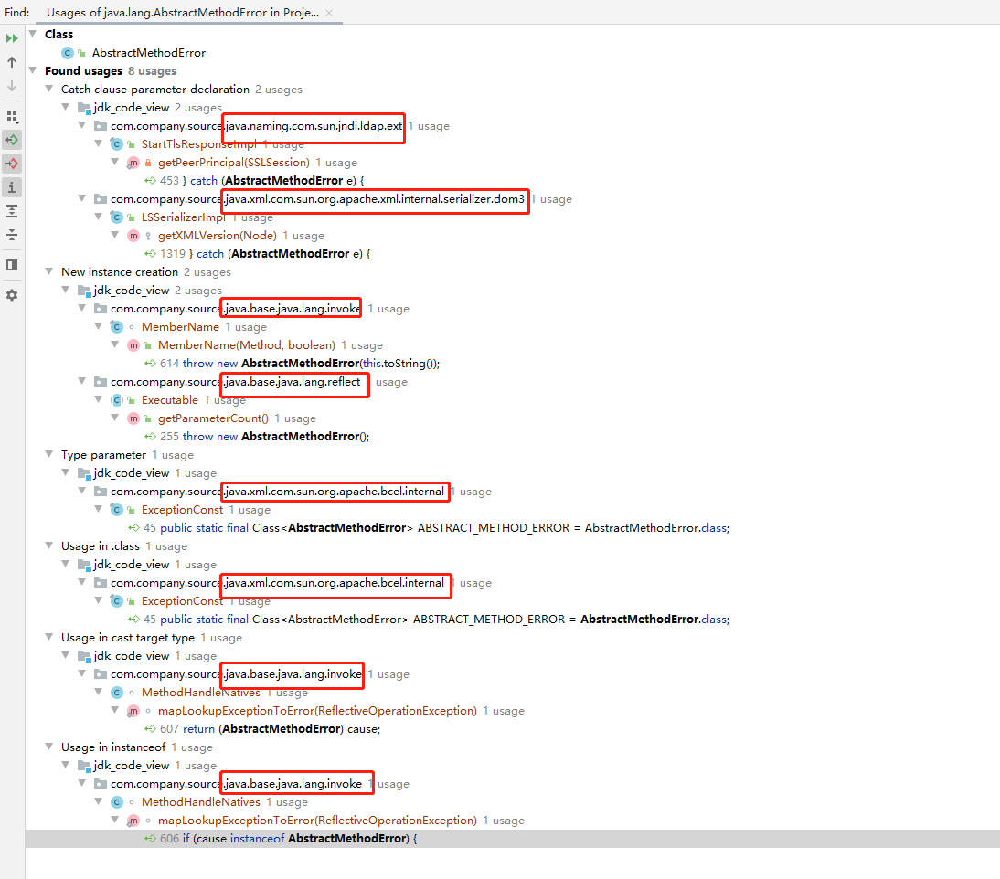

#### AbstractStringBuilder

***

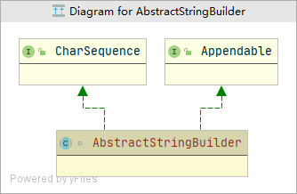

#### ArithmeticException

***

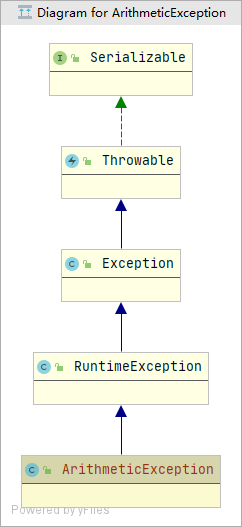

#### ArrayIndexOutOfBoundsException

***

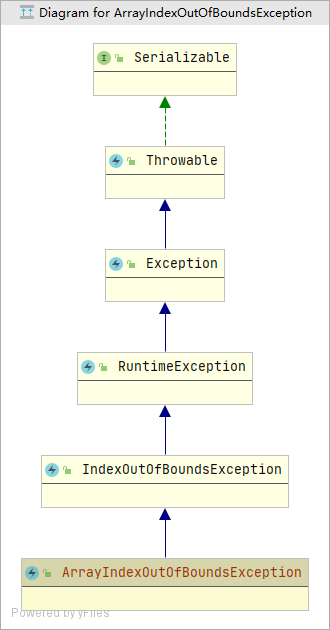

#### ArrayStoreException

***

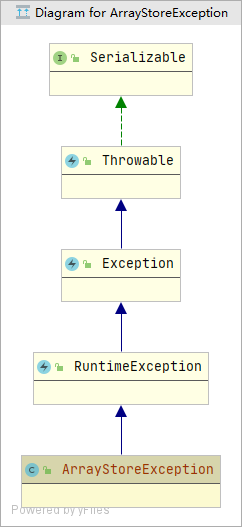

#### AssertionError

***

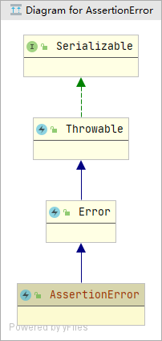

#### Boolean

***

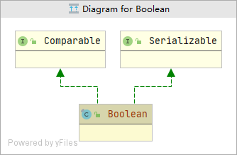

#### BootstrapMethodError

***

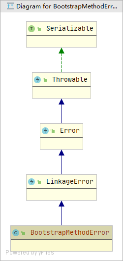

#### Byte

***

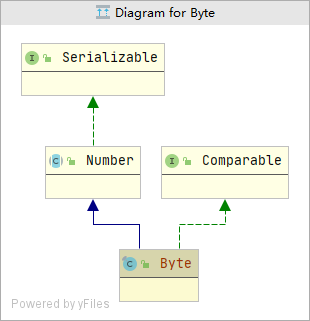

#### Character

***

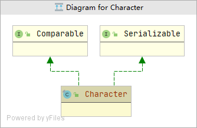

#### CharacterData0E

***

#### CharacterData00

***

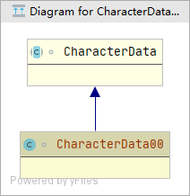

#### CharacterData01

***

#### CharacterData02

***

#### CharacterDataLatin1

***

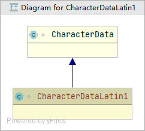

#### CharacterDataPrivateUse

***

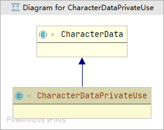

#### CharacterDataUndefined

***

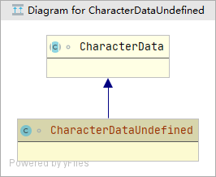

#### Class

***

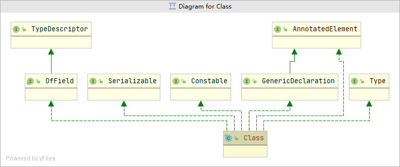

#### ClassCastException

***

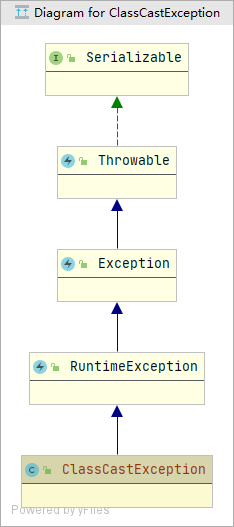

#### ClassCircularityError

***

#### ClassFormatError

***

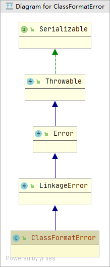

#### ClassNotFoundException

***

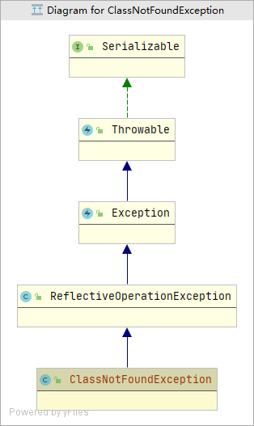

#### CloneNotSupportedException

***

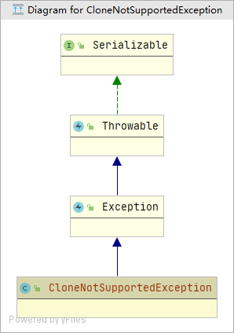

#### Double

***

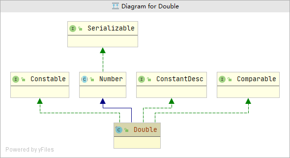

#### Enum

***

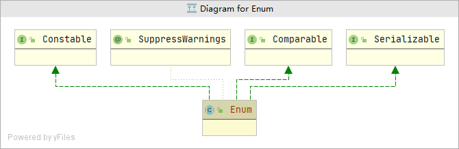

#### EnumConstantNotPresentException

***

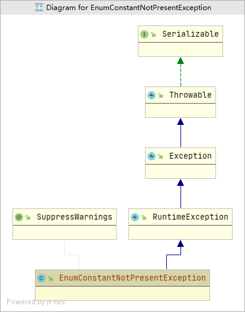

#### ExceptionInInitializerError

***

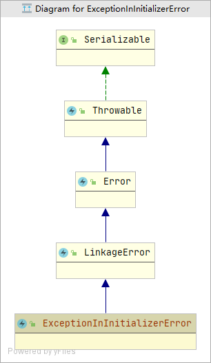

#### Float

***

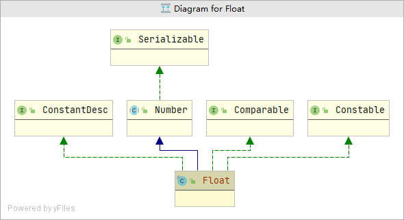

#### IllegalAccessError

***

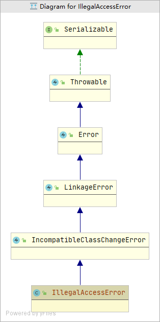

#### IllegalAccessException

***

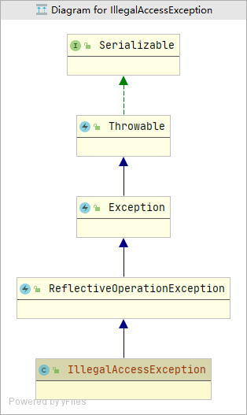

#### IllegalArgumentException

***

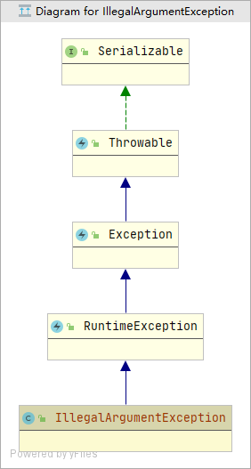

#### IllegalCallerException

***

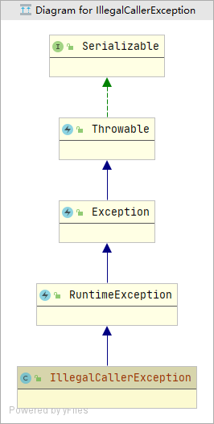

#### IllegalMonitorStateException

***

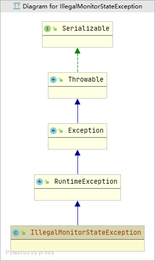

#### IllegalStateException

***

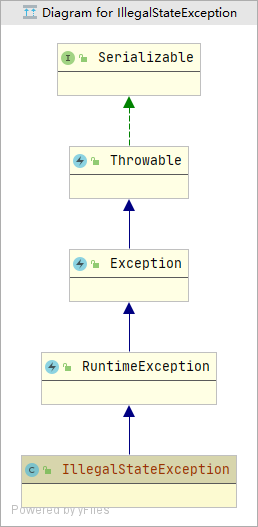

####  IllegalThreadStateException

***

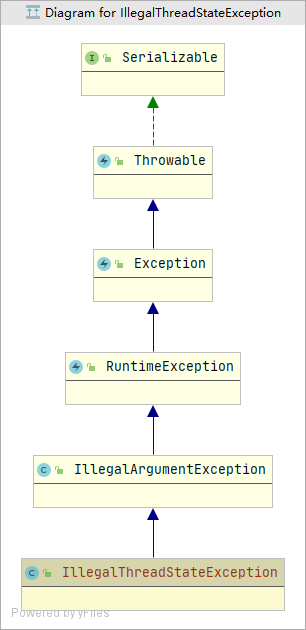

#### IndexOutOfBoundsException

***

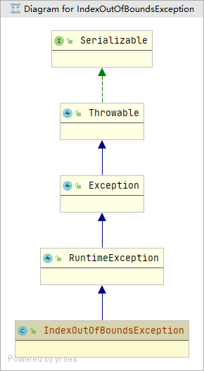

#### InheritableThreadLocal

***

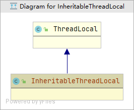

#### InstantiationError

***

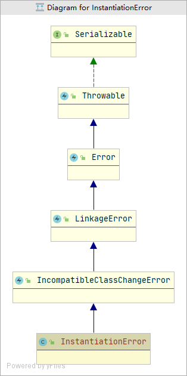

#### InstantiationException

***

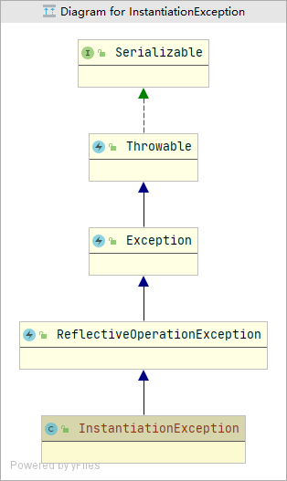

#### Integer

***

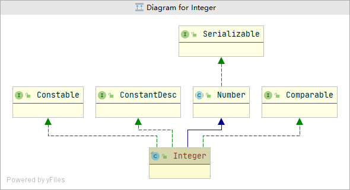

#### InternalError

***

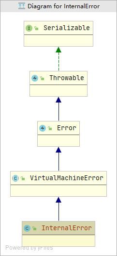

#### InterruptedException

***

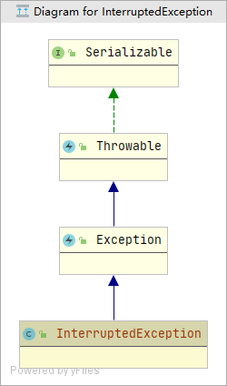

#### LayerInstantiationException

***

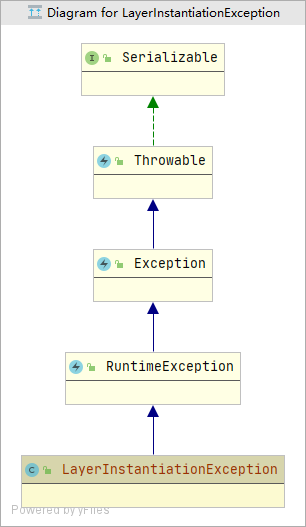

#### LinkageError

***

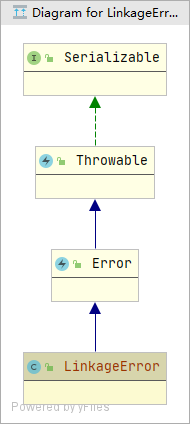

#### LiveStackFrame

***

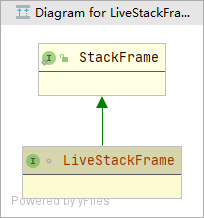

#### LiveStackFrameInfo

***

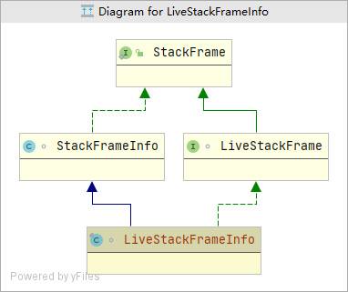

#### Long

***

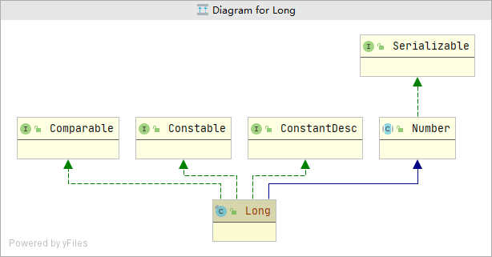

#### Module

***

#### NegativeArraySizeException

***

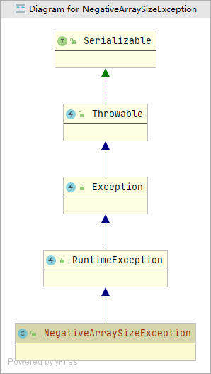

#### NoClassDefFoundError

***

#### NoSuchFieldError

***

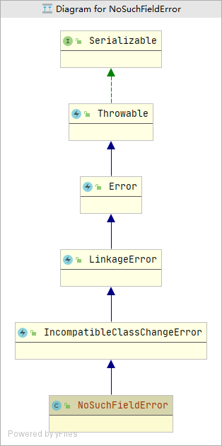

#### NoSuchFieldException

***

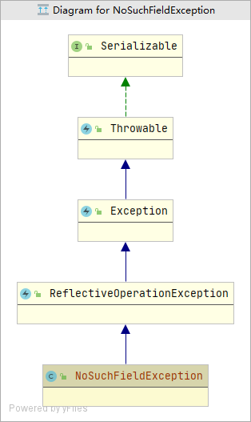

#### NoSuchMethodError

***

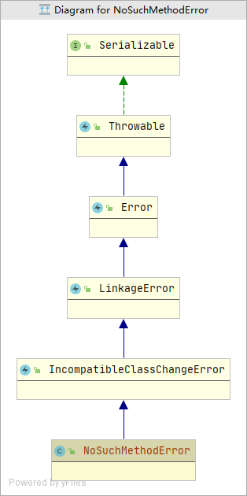

#### NoSuchMethodException

***

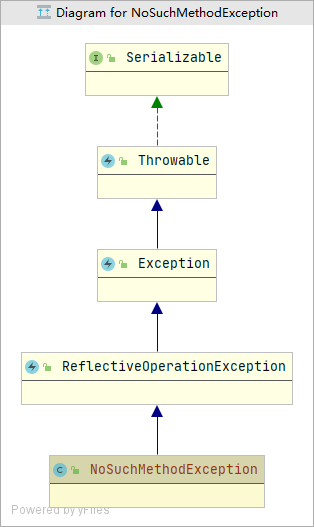

#### NullPointerException

***

#### NumberFormatException

***

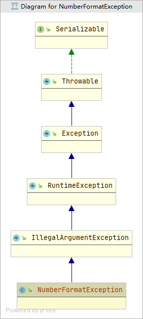

#### OutOfMemoryError

***

#### Package

***

#### ProcessEnvironment

***

#### ProcessHandle

***

#### ProcessHandleImpl

***

#### ProcessImpl

***

#### ReflectiveOperationException

***

#### RuntimeException

***

#### RuntimePermission

***

#### SecurityException

***

#### Short

***

#### StackFrameInfo

***

#### StackOverflowError

***

#### StackTraceElement

***

#### String

***

#### StringBuffer

***

#### StringBuilder

***

#### StringIndexOutOfBoundsException

***

#### Thread

***

#### ThreadDeath

***

#### ThreadGroup

***

#### TypeNotPresentException

***

#### UnknownError

***

#### UnsatisfiedLinkError

***

#### UnsupportedClassVersionError

***

#### UnsupportedOperationException

***

#### VerifyError

***

#### VirtualMachineError

***

