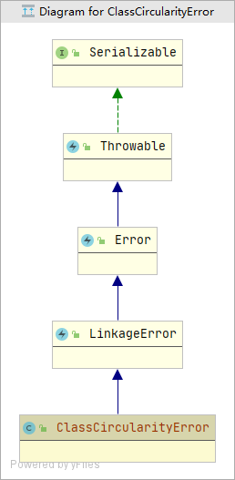
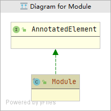
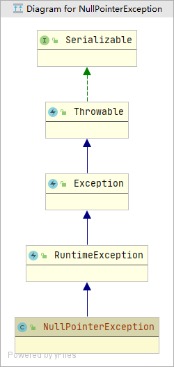
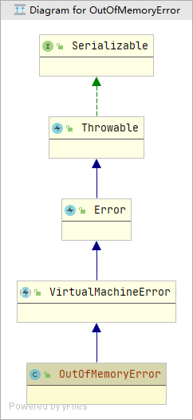
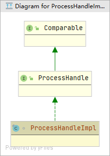
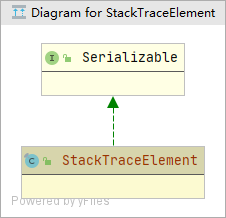
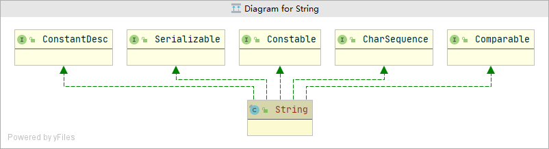
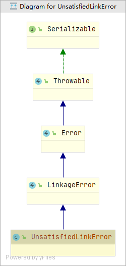

#### AbstractMethodError
***

#### AbstractStringBuilder

***

#### ArithmeticException

***

#### ArrayIndexOutOfBoundsException

***

#### ArrayStoreException

***

#### AssertionError

***

#### Boolean

***

#### BootstrapMethodError

***

#### Byte

***

#### Character

***

#### CharacterData0E

***

#### CharacterData00

***

#### CharacterData01

***

#### CharacterData02

***

#### CharacterDataLatin1

***

#### CharacterDataPrivateUse

***

#### CharacterDataUndefined

***

#### Class

***

#### ClassCastException

***

#### ClassCircularityError

***

#### ClassFormatError

***

#### ClassNotFoundException

***

#### CloneNotSupportedException

***

#### Double

***

#### Enum

***

#### EnumConstantNotPresentException

***

#### ExceptionInInitializerError

***

#### Float

***

#### IllegalAccessError

***

#### IllegalAccessException

***

#### IllegalArgumentException

***

#### IllegalCallerException

***

#### IllegalMonitorStateException

***

#### IllegalStateException

***

####  IllegalThreadStateException

***

#### IndexOutOfBoundsException

***

#### InheritableThreadLocal

***

#### InstantiationError

***

#### InstantiationException

***

#### Integer

***

#### InternalError

***

#### InterruptedException

***

#### LayerInstantiationException

***

#### LinkageError

***

#### LiveStackFrame

***

#### LiveStackFrameInfo

***

#### Long

***

#### Module

***

#### NegativeArraySizeException

***

#### NoClassDefFoundError

***

#### NoSuchFieldError

***

#### NoSuchFieldException

***

#### NoSuchMethodError

***

#### NoSuchMethodException

***

#### NullPointerException

***

#### NumberFormatException

***

#### OutOfMemoryError

***

#### Package

***

#### ProcessEnvironment

***

#### ProcessHandle

***

#### ProcessHandleImpl

***

#### ProcessImpl

***

#### ReflectiveOperationException

***

#### RuntimeException

***

#### RuntimePermission

***

#### SecurityException

***

#### Short

***

#### StackFrameInfo

***

#### StackOverflowError

***

#### StackTraceElement

***

#### String

***

#### StringBuffer

***

#### StringBuilder

***

#### StringIndexOutOfBoundsException

***

#### Thread

***

#### ThreadDeath

***

#### ThreadGroup

***

#### TypeNotPresentException

***

#### UnknownError

***

#### UnsatisfiedLinkError

***

#### UnsupportedClassVersionError

***

#### UnsupportedOperationException

***

#### VerifyError

***

#### VirtualMachineError

***

